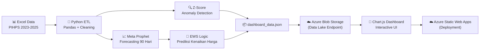

# 🛡️ Aceh Resilience Monitor (ARM)


> **Platform Intelijen Harga Pangan Berbasis AI** — Dari pemantauan reaktif ke prediksi proaktif.

**🔗 Live Dashboard:** [https://thankful-river-084494910.7.azurestaticapps.net](https://thankful-river-084494910.7.azurestaticapps.net)

**📋 Project Brief:** [project_brief_final.md](project_brief_final.md)

**Topik:** Ketahanan Pangan & Agrikultur Modern  
**Kompetisi:** Datathon Dicoding × Microsoft Elevate Training Center 2026

---

## 📌 Problem Statement

Volatilitas harga pangan strategis sering kali memicu lonjakan inflasi daerah. Dalam praktiknya, pengambilan keputusan oleh pemangku kebijakan (seperti Tim Pengendalian Inflasi Daerah/TPID) sering terhambat oleh **lambatnya integrasi data** dan **ketidakmampuan untuk memprediksi tren harga di masa depan** berdasarkan data historis.

**Research Questions:**
1. Komoditas apa saja yang saat ini menunjukkan anomali harga tertinggi (kritis) di luar kewajaran pergerakan rata-rata?
2. Komoditas apa yang diprediksi oleh *Machine Learning* akan mengalami lonjakan harga terekstrem dalam 90 hari ke depan?

**Solusi:** Aceh Resilience Monitor (ARM) adalah platform intelijen harga pangan yang mengintegrasikan **Statistical Anomaly Detection** (Z-Score) dan **AI Forecasting** (Meta Prophet) ke dalam satu dasbor interaktif. ARM bertindak sebagai *painkiller*: memberikan instrumen mitigasi proaktif yang siap pakai untuk menstabilkan perekonomian daerah **sebelum** inflasi terjadi.

---

## 🏗️ Arsitektur Sistem



---

## ✨ Fitur Utama

| No | Fitur | Deskripsi | Kontributor |
|---|---|---|---|
| 1 | **Automated ETL Pipeline** | Membersihkan data harga harian dari 3 file Excel (2023–2025) yang formatnya berantakan (angka romawi, format tanggal tidak standar, string Rupiah) menjadi dataset terstruktur siap analisis. | Ilhaam |
| 2 | **Statistical Anomaly Detection** | Mendeteksi lonjakan harga abnormal menggunakan Z-Score terhadap Moving Average 30 hari. Mengklasifikasikan sebagai ⚠️ WASPADA atau 🚨 KRITIS. | Ilhaam |
| 3 | **Interactive Dashboard** | Antarmuka visual premium (dark glassmorphism) dengan 8+ komponen interaktif: KPI cards, status grid, price trend, YoY comparison, seasonality heatmap, volatility heatmap, stacked area chart. | Ilhaam |
| 4 | **ML Forecasting 90 Hari** | Script Python melakukan *looping* ke-18 komoditas dan membuat **1 model Prophet per komoditas** (total 18 model terpisah), masing-masing dilatih khusus untuk memprediksi harga 90 hari ke depan, termasuk batas kepercayaan atas/bawah (*Confidence Interval*). | Aulia |
| 5 | **🚨 Early Warning System (EWS) Cards** | Panel peringatan visual berupa kartu yang menyoroti 3 komoditas paling rentan mengalami lonjakan harga ekstrem. Setiap kartu menampilkan persentase lonjakan, harga prediksi, label bahaya (EKSTREM/WASPADA), dan rekomendasi tindakan konkret bagi pemerintah. | Aulia |
| 6 | **Prophet Model Evaluation** | Notebook riset (`evaluate_prophet.ipynb`) dengan backtesting Train/Test Split — metrik MAE, RMSE, dan MAPE untuk ke-18 komoditas. | Aulia |
| 7 | **Azure Blob Storage (Data Lake)** | Implementasi Azure Blob Storage sebagai *data lake* untuk menyimpan dan mendistribusikan data JSON dasbor secara *cloud-native* dengan keamanan CORS terpusat. | Aulia |
| 8 | **Data Scraping** | Pengumpulan data harga komoditas dari sumber PIHPS untuk memastikan kelengkapan dataset 2023–2025. | Arief |

---

## 📐 Evaluasi Model (Backtesting)

Metode: **Train/Test Split (Holdout 90 Hari)**  
- **Data Training:** Januari 2023 – September 2025 (± 730 hari)  
- **Data Testing:** Oktober – Desember 2025 (90 hari, disembunyikan dari model)

| Kategori | Contoh Komoditas | MAPE | MAE (Rp) | Keterangan |
|---|---|---|---|---|
| 🟢 **Sangat Akurat** | Daging Sapi Kualitas 1 | **0.49%** | Rp 782 | Error < 5%, siap referensi kebijakan |
| 🟢 **Sangat Akurat** | Beras (6 varian) | **1.4 – 2.2%** | Rp 150 – 250 | Sangat stabil dan terprediksi |
| 🟡 **Cukup Akurat** | Telur Ayam, Bawang Putih | **6 – 12%** | Rp 2,000 – 5,000 | Dapat menangkap tren jangka menengah |
| 🔴 **Sulit Diprediksi** | Cabai Merah, Bawang Merah | **20 – 33%** | Rp 8,000 – 15,000 | Volatilitas tinggi, butuh data eksternal (cuaca) |

**Rata-rata MAPE keseluruhan: 7.74%** (Kategori: Sangat Baik)

> Detail lengkap tersedia di: [`evaluation_prophet.md`](evaluation_prophet.md) dan [`scripts/evaluate_prophet.ipynb`](scripts/evaluate_prophet.ipynb)

---

## 🛠️ Teknologi yang Digunakan

| Komponen | Teknologi | Fungsi |
|---|---|---|
| Data Processing | Python, Pandas, NumPy | ETL, cleaning, transformasi data kotor Excel |
| Machine Learning | **Meta Prophet** | Time-series forecasting 90 hari (1 model per komoditas × 18 komoditas) |
| Visualization | Chart.js v4, Vanilla JS | Dashboard interaktif premium |
| Styling | Vanilla CSS (Glassmorphism) | UI/UX dark mode premium |
| Cloud Storage | **Azure Blob Storage** | Data Lake — penyimpanan & distribusi dataset JSON terpusat |
| Deployment | **Azure Static Web Apps** | Hosting serverless untuk dasbor publik |
| Version Control | Git, GitHub | Kolaborasi tim (branch per anggota) |

---

## 🚀 Cara Menjalankan (Lokal)

### Prasyarat
- Python 3.9+
- pip

### 1. Clone Repository
```bash
git clone https://github.com/aceh-resilience-monitor/Aceh-Resilience-Monitor.git
cd Aceh-Resilience-Monitor
```

### 2. Install Dependencies
```bash
pip install -r requirements.txt
```

### 3. Jalankan Pipeline Data
```bash
python scripts/prepare_dashboard_data.py
```
Script ini akan: membersihkan data Excel → melatih 18 model Prophet → menghitung anomali Z-Score → menghasilkan prediksi EWS → menyimpan output ke `dashboard/dashboard_data.json`.

### 4. Buka Dashboard
Buka file `dashboard/index.html` di browser, atau akses versi live:  
🔗 [https://thankful-river-084494910.7.azurestaticapps.net](https://thankful-river-084494910.7.azurestaticapps.net)

---

## 📁 Struktur Repositori

```
datathon-dicoding/
├── Data/                               # Dataset mentah (PIHPS)
│   ├── 2023.xlsx                       # Harga harian 18 komoditas tahun 2023
│   ├── 2024.xlsx                       # Harga harian 18 komoditas tahun 2024
│   └── 2025.xlsx                       # Harga harian 18 komoditas tahun 2025
├── dashboard/                          # Frontend dashboard
│   ├── index.html                      # Halaman utama dashboard
│   ├── app.js                          # Logika rendering Chart.js + EWS + interaktivitas
│   ├── style.css                       # Desain premium dark glassmorphism
│   ├── dashboard_data.json             # Output data pipeline (auto-generated)
│   ├── dashboard_data.js               # Embedded JS version (untuk file://)
│   └── staticwebapp.config.json        # Konfigurasi Azure Static Web Apps
├── scripts/                            # Backend pipeline
│   ├── prepare_dashboard_data.py       # ETL + Prophet + EWS Logic + JSON export
│   └── evaluate_prophet.ipynb          # Notebook evaluasi model (backtesting)
├── docs/                               # Dokumentasi analisis
│   ├── data_analysis.md                # Analisis kualitas & struktur data awal
│   ├── eda_interpretation.md           # Interpretasi insight dari EDA
│   ├── fabric_recommendation.md        # Rekomendasi arsitektur Microsoft Fabric
│   └── project_brief.md               # Draft awal project brief
├── plots/                              # Output visualisasi EDA
├── requirements.txt                    # Dependensi Python
├── README.md                           # Dokumentasi proyek (file ini)
├── project_brief_final.md              # Project Brief Final untuk submission
└── evaluation_prophet.md               # Laporan evaluasi metrik model Prophet
```

---

## 🍚 Komoditas yang Dipantau (18 Komoditas)

| Kategori | Komoditas |
|----------|-----------|
| **Beras** | Bawah I, Bawah II, Medium I, Medium II, Super I, Super II |
| **Daging Ayam** | Ayam Ras Segar |
| **Daging Sapi** | Kualitas 1 |
| **Telur Ayam** | Ras Segar |
| **Bawang Merah** | Ukuran Sedang |
| **Bawang Putih** | Ukuran Sedang |
| **Cabai Merah** | Keriting |
| **Cabai Rawit** | Hijau |
| **Minyak Goreng** | Curah, Kemasan Bermerk 1, Kemasan Bermerk 2 |
| **Gula Pasir** | Kualitas Premium, Lokal |

---

## 📚 Dokumentasi Lengkap

| Dokumen | Deskripsi |
|---------|-----------|
| [project_brief_final.md](project_brief_final.md) | **Project Brief Final** — Ringkasan eksekutif, fitur, teknologi, dan cara penggunaan |
| [evaluation_prophet.md](evaluation_prophet.md) | **Laporan Evaluasi Model AI** — Backtesting, metrik MAE/RMSE/MAPE untuk 18 komoditas |
| [docs/eda_interpretation.md](docs/eda_interpretation.md) | **Interpretasi Insight EDA** — Analisis tren, pola musiman, dan temuan anomali |
| [docs/data_analysis.md](docs/data_analysis.md) | **Analisis Kualitas Data** — Profiling struktur Excel, missing values, format cleaning |
| [scripts/eda.ipynb](scripts/eda.ipynb) | **Notebook EDA** — Eksplorasi data interaktif, visualisasi distribusi & tren harga komoditas |
| [scripts/evaluate_prophet.ipynb](scripts/evaluate_prophet.ipynb) | **Notebook Evaluasi Prophet** — Kode backtesting interaktif dengan visualisasi per komoditas |

---

## 🗺️ Rencana Pengembangan Lanjutan (Future Roadmap)

| Fase | Fitur | Deskripsi |
|------|-------|-----------|
| **Fase 1** | Real-time Notifications | Integrasi Bot Telegram/WhatsApp untuk push notification anomali harga ke Satgas Pangan |
| **Fase 2** | Correlation-Based Alerts | Peringatan rambatan inflasi lintas komoditas (misal: pakan naik → telur ikut naik) |
| **Fase 3** | Multivariate AI | Integrasi data cuaca BMKG sebagai regressor eksternal untuk memprediksi gagal panen |

---

## 👥 Tim & Kontribusi

| Nama | Peran | Kontribusi Utama |
|------|-------|------------------|
| **Aulia Muzhaffar** | ML Engineer & Analytics | Forecasting Prophet (18 model, 1 per komoditas), Early Warning System (EWS) Logic, Evaluasi Model (MAE/RMSE/MAPE), Azure Blob Storage, Bug Fixing Dashboard |
| **Muhammad Ilhaam Ghiffary** | Data Engineer & Frontend | EDA & Notebook Analytics, Data Pipeline ETL, Z-Score Anomaly Detection, Desain & Pengembangan Dashboard UI/UX |
| **Arief Hidayah** | Data Acquisition & Repo Manager | Scraping Data Komoditas, Manajemen Repository GitHub |

---

## 📄 Lisensi

Proyek ini dikembangkan untuk keperluan **Datathon Dicoding × Microsoft Elevate Training Center 2026**.  
Dataset bersumber dari **PIHPS** (Pusat Informasi Harga Pangan Strategis Nasional).
