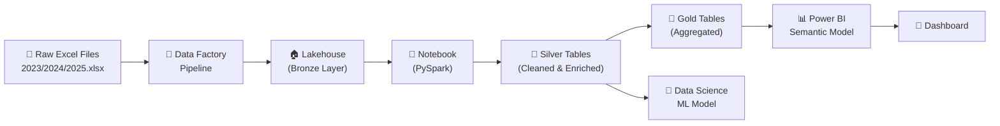

# 🏗️ Rekomendasi Pengolahan Data di Microsoft Fabric

Berdasarkan dataset harga bahan pokok harian (2023–2025) dan insight EDA yang sudah kita dapatkan, berikut rekomendasi arsitektur dan langkah-langkah di Microsoft Fabric.

---

## 📐 Arsitektur yang Disarankan



---

## 1️⃣ Langkah 1 — Setup Lakehouse (Medallion Architecture)

Gunakan **Medallion Architecture** (Bronze → Silver → Gold):

| Layer | Isi | Format |
|-------|-----|--------|
| **Bronze** | Raw Excel files apa adanya, tanpa transformasi | Files (as-is) |
| **Silver** | Data bersih: tidy format, tipe data benar, enriched dengan kolom tambahan | Delta Table |
| **Gold** | Aggregasi siap pakai untuk reporting (monthly avg, YoY change, volatility metrics) | Delta Table |

### Cara Setup:
1. Buat **Workspace** baru di Fabric (misal: `datathon-commodity-prices`)
2. Buat **Lakehouse** (misal: `lakehouse_commodity`)
3. Upload 3 file Excel (`2023.xlsx`, `2024.xlsx`, `2025.xlsx`) ke folder `Files/raw/`

---

## 2️⃣ Langkah 2 — Ingestion via Data Pipeline (Data Factory)

Buat **Data Pipeline** sederhana untuk otomasi:

```
Pipeline: ingest_commodity_data
├── ForEach Activity (loop over [2023, 2024, 2025])
│   └── Copy Activity: Files/raw/{year}.xlsx → Bronze
└── Notebook Activity: run transform_notebook
```

> [!TIP]
> Jika datanya statis (hanya 3 file), bisa skip pipeline dan langsung proses di Notebook. Pipeline lebih berguna kalau ada data baru secara berkala.

---

## 3️⃣ Langkah 3 — Transformasi di Notebook (PySpark)

Buat **Fabric Notebook** untuk membersihkan data. Berikut template yang bisa langsung dipakai:

### Bronze → Silver

```python
# ── Cell 1: Read raw files from Lakehouse ──
from pyspark.sql import functions as F
from pyspark.sql.types import *
import pandas as pd
import numpy as np

# Read Excel files (use pandas, lalu convert ke Spark DF)
def load_and_clean_excel(filepath, year):
    """Load Excel file and return clean pandas DataFrame."""
    raw = pd.read_excel(filepath, header=None)
    
    # Extract dates from row 0
    date_strings = raw.iloc[0, 2:].values
    dates = pd.to_datetime(date_strings, format='%d/ %m/ %Y')
    
    # Filter: keep commodity rows only (skip Roman numeral category rows)
    roman = {'I','II','III','IV','V','VI','VII','VIII','IX','X'}
    data_rows = raw.iloc[1:]
    mask = ~data_rows.iloc[:, 0].isin(roman)
    commodity_data = data_rows[mask].copy()
    
    records = []
    for _, row in commodity_data.iterrows():
        commodity = row.iloc[1].strip()
        prices = row.iloc[2:].values
        for date, price in zip(dates, prices):
            price_str = str(price).strip()
            if pd.isna(price) or price_str in ('', '-', 'nan'):
                price_val = None
            else:
                price_val = float(price_str.replace(',', ''))
            records.append({
                'date': date,
                'commodity': commodity,
                'price': price_val,
                'year': year
            })
    return pd.DataFrame(records)

# Load all files
base_path = "Files/raw/"  # path di Lakehouse
dfs = []
for year in [2023, 2024, 2025]:
    pdf = load_and_clean_excel(f"/lakehouse/default/{base_path}{year}.xlsx", year)
    dfs.append(pdf)

pdf_all = pd.concat(dfs, ignore_index=True)
```

```python
# ── Cell 2: Enrich & create Silver table ──
CATEGORY_MAP = {
    'Beras Kualitas Bawah I': 'Beras',
    'Beras Kualitas Bawah II': 'Beras',
    'Beras Kualitas Medium I': 'Beras',
    'Beras Kualitas Medium II': 'Beras',
    'Beras Kualitas Super I': 'Beras',
    'Beras Kualitas Super II': 'Beras',
    'Daging Ayam Ras Segar': 'Daging Ayam',
    'Daging Sapi Kualitas 1': 'Daging Sapi',
    'Telur Ayam Ras Segar': 'Telur Ayam',
    'Bawang Merah Ukuran Sedang': 'Bawang Merah',
    'Bawang Putih Ukuran Sedang': 'Bawang Putih',
    'Cabai Merah Keriting': 'Cabai Merah',
    'Cabai Rawit Hijau': 'Cabai Rawit',
    'Minyak Goreng Curah': 'Minyak Goreng',
    'Minyak Goreng Kemasan Bermerk 1': 'Minyak Goreng',
    'Minyak Goreng Kemasan Bermerk 2': 'Minyak Goreng',
    'Gula Pasir Kualitas Premium': 'Gula Pasir',
    'Gula Pasir Lokal': 'Gula Pasir',
}

pdf_all['category'] = pdf_all['commodity'].map(CATEGORY_MAP)
pdf_all['month'] = pd.to_datetime(pdf_all['date']).dt.month
pdf_all['quarter'] = pd.to_datetime(pdf_all['date']).dt.quarter
pdf_all['day_of_week'] = pd.to_datetime(pdf_all['date']).dt.day_name()
pdf_all['is_ramadan_period'] = pdf_all['month'].isin([3, 4])  # simplified

# Convert to Spark DF and save as Delta Table
sdf = spark.createDataFrame(pdf_all)
sdf.write.format("delta").mode("overwrite").saveAsTable("silver_daily_prices")

print(f"✅ Silver table created: {sdf.count():,} rows")
```

### Silver → Gold (Aggregated Tables)

```python
# ── Cell 3: Gold tables for reporting ──

# Gold 1: Monthly aggregates
spark.sql("""
    CREATE OR REPLACE TABLE gold_monthly_stats AS
    SELECT 
        year,
        month,
        commodity,
        category,
        COUNT(price) as trading_days,
        ROUND(AVG(price), 0) as avg_price,
        ROUND(STDDEV(price), 0) as std_price,
        ROUND(MIN(price), 0) as min_price,
        ROUND(MAX(price), 0) as max_price,
        ROUND(PERCENTILE(price, 0.5), 0) as median_price,
        ROUND(STDDEV(price) / AVG(price) * 100, 2) as cv_pct
    FROM silver_daily_prices
    WHERE price IS NOT NULL
    GROUP BY year, month, commodity, category
""")

# Gold 2: YoY comparison
spark.sql("""
    CREATE OR REPLACE TABLE gold_yoy_changes AS
    WITH yearly AS (
        SELECT year, commodity, category,
               AVG(price) as avg_price
        FROM silver_daily_prices
        WHERE price IS NOT NULL
        GROUP BY year, commodity, category
    )
    SELECT 
        curr.commodity,
        curr.category,
        prev.year as prev_year,
        curr.year as curr_year,
        ROUND(prev.avg_price, 0) as prev_avg,
        ROUND(curr.avg_price, 0) as curr_avg,
        ROUND((curr.avg_price - prev.avg_price) / prev.avg_price * 100, 2) as pct_change
    FROM yearly curr
    JOIN yearly prev ON curr.commodity = prev.commodity 
                    AND curr.year = prev.year + 1
    ORDER BY curr.year, pct_change DESC
""")

# Gold 3: Volatility summary
spark.sql("""
    CREATE OR REPLACE TABLE gold_volatility AS
    SELECT 
        year,
        commodity,
        category,
        ROUND(STDDEV(price) / AVG(price) * 100, 2) as cv_pct,
        CASE 
            WHEN STDDEV(price)/AVG(price)*100 > 20 THEN 'Very High'
            WHEN STDDEV(price)/AVG(price)*100 > 10 THEN 'High'
            WHEN STDDEV(price)/AVG(price)*100 > 5 THEN 'Medium'
            ELSE 'Low'
        END as volatility_level
    FROM silver_daily_prices
    WHERE price IS NOT NULL
    GROUP BY year, commodity, category
""")

print("✅ Gold tables created: gold_monthly_stats, gold_yoy_changes, gold_volatility")
```

---

## 4️⃣ Langkah 4 — Power BI Semantic Model & Dashboard

Setelah Gold tables siap, buat **Semantic Model** langsung dari Lakehouse:

### Tabel yang Digunakan:
- `silver_daily_prices` → untuk drill-down detail
- `gold_monthly_stats` → untuk dashboard utama
- `gold_yoy_changes` → untuk halaman perbandingan tahunan
- `gold_volatility` → untuk analisis risiko

### Saran Halaman Dashboard:

| Halaman | Visual | Data Source |
|---------|--------|-------------|
| **Overview** | KPI Cards (avg price, total commodities, date range), Line chart (daily trend), Slicer (year, category) | `silver_daily_prices` |
| **Price Trends** | Multi-line chart per commodity, Area chart with MA30 | `silver_daily_prices` |
| **YoY Comparison** | Clustered bar chart, Waterfall chart | `gold_yoy_changes` |
| **Volatility** | Heatmap (matrix visual), Gauges per commodity | `gold_volatility` |
| **Seasonality** | Matrix visual (month × commodity), Conditional formatting | `gold_monthly_stats` |
| **Alerts** | Table dengan conditional formatting untuk spike detection | Custom measure |

### DAX Measures yang Berguna:

```dax
// Moving Average 30 hari
MA30 = 
AVERAGEX(
    DATESINPERIOD('silver_daily_prices'[date], MAX('silver_daily_prices'[date]), -30, DAY),
    CALCULATE(AVERAGE('silver_daily_prices'[price]))
)

// YoY % Change
YoY Change % = 
VAR CurrentYearAvg = AVERAGE('silver_daily_prices'[price])
VAR PreviousYearAvg = CALCULATE(
    AVERAGE('silver_daily_prices'[price]),
    SAMEPERIODLASTYEAR('silver_daily_prices'[date])
)
RETURN DIVIDE(CurrentYearAvg - PreviousYearAvg, PreviousYearAvg) * 100

// Volatility Flag
VolatilityFlag = 
IF(
    DIVIDE(STDEV.P('silver_daily_prices'[price]), AVERAGE('silver_daily_prices'[price])) > 0.2,
    "⚠️ HIGH", "✅ Normal"
)
```

---

## 5️⃣ (Opsional) Langkah 5 — Data Science: Forecasting

Jika ingin prediksi harga ke depan, gunakan **Fabric Data Science**:

```python
# Di Fabric Notebook (ML section)
from prophet import Prophet

# Forecast per commodity
commodity = "Cabai Merah Keriting"
df_prophet = sdf.filter(F.col("commodity") == commodity)\
    .select(F.col("date").alias("ds"), F.col("price").alias("y"))\
    .toPandas()

model = Prophet(
    yearly_seasonality=True,
    weekly_seasonality=False,
    changepoint_prior_scale=0.1
)
model.fit(df_prophet)

future = model.make_future_dataframe(periods=90)  # 90 hari ke depan
forecast = model.predict(future)

# Save forecast results
sdf_forecast = spark.createDataFrame(forecast[['ds','yhat','yhat_lower','yhat_upper']])
sdf_forecast.write.format("delta").mode("overwrite").saveAsTable(f"forecast_{commodity.replace(' ','_').lower()}")
```

> [!NOTE]
> Prophet cocok untuk data ini karena bisa menangkap **seasonality** (Ramadan, Natal) dan **trend** secara otomatis.

---

## 📋 Checklist Implementasi

- [ ] Buat Workspace di Microsoft Fabric
- [ ] Buat Lakehouse (`lakehouse_commodity`)
- [ ] Upload 3 file Excel ke `Files/raw/`
- [ ] Buat Notebook → Transform Bronze → Silver → Gold
- [ ] Verifikasi tabel Gold (row count, sample data)
- [ ] Buat Semantic Model dari Gold tables
- [ ] Bangun Dashboard Power BI (5 halaman)
- [ ] *(Opsional)* Buat ML experiment untuk forecasting 
- [ ] *(Opsional)* Setup Data Pipeline untuk scheduled refresh

---

## ⚠️ Tips & Hal yang Perlu Diperhatikan

1. **Format Excel yang unik**: Karena file Excel punya struktur khusus (Roman numeral headers, comma-separated prices), **jangan** gunakan `spark.read.excel()` langsung — pakai `pandas` dulu baru convert ke Spark DF.

2. **Kapasitas Fabric**: Untuk dataset sekecil ini (~14K rows), bahkan Fabric Trial capacity sudah cukup. Tidak perlu scaling khusus.

3. **Delta Table vs File**: Selalu simpan clean data sebagai **Delta Table** — ini memberikan versioning, time travel, dan performa query yang lebih baik.

4. **Scheduling**: Jika data diperbaharui berkala, buat pipeline dengan schedule trigger (misalnya monthly).

5. **Governance**: Gunakan **Data Lineage** di Fabric untuk tracking asal data dari Excel → Bronze → Silver → Gold → Dashboard.
