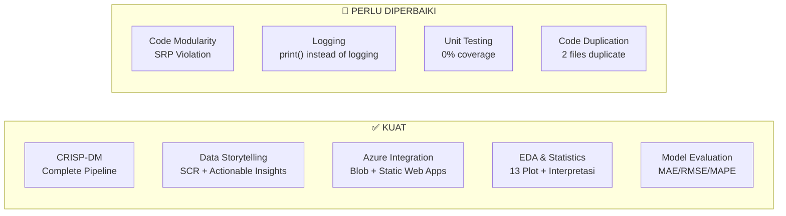

# 🔍 Audit Report: ARM vs AI Impact Challenge Curriculum

> Audit menyeluruh terhadap repo **Aceh Resilience Monitor (ARM)** berdasarkan 4 modul kurikulum **AI Impact Challenge** oleh Ridha Ginanjar.

---

## 📊 Scorecard Ringkasan

| # | Modul Kurikulum | Skor | Status |
|---|---|:---:|:---:|
| 1 | The Essence of Data Science (CRISP-DM) | **8/10** | 🟢 Kuat |
| 2 | Software Engineering for Data Scientists | **5/10** | 🟡 Perlu Perbaikan |
| 3 | Scale Up Your Solutions with Azure | **7/10** | 🟢 Cukup Baik |
| 4 | Become The Data Storyteller | **8/10** | 🟢 Kuat |
| | **TOTAL** | **28/40** | **70% — Solid, tapi ada gap penting** |

---

## Modul 1: The Essence of Data Science (CRISP-DM)

### ✅ Yang Sudah Sesuai

| Tahap CRISP-DM | Evidence di ARM | File |
|---|---|---|
| **Business Problem** | Problem statement jelas: "volatilitas harga pangan → butuh prediksi proaktif". Research questions terdefinisi dengan baik (2 pertanyaan). | [project_brief_final.md](file:///Users/auliamuzhaffar/Documents/Datathon/datathon-dicoding/project_brief_final.md) |
| **Data Understanding** | Analisis kualitas data lengkap: 18 komoditas, 3 tahun, format issues didokumentasikan. Statistik deskriptif per tahun tersedia. | [data_analysis.md](file:///Users/auliamuzhaffar/Documents/Datathon/datathon-dicoding/data_analysis.md) |
| **Data Preparation** | ETL pipeline yang robust: handling missing values, format tanggal non-standar, angka romawi, string Rupiah → numerik. | [prepare_dashboard_data.py](file:///Users/auliamuzhaffar/Documents/Datathon/datathon-dicoding/scripts/prepare_dashboard_data.py) |
| **Modelling** | Prophet forecasting 90 hari, 18 model independen (1 per komoditas), Z-Score anomaly detection. | [prepare_dashboard_data.py L288-337](file:///Users/auliamuzhaffar/Documents/Datathon/datathon-dicoding/scripts/prepare_dashboard_data.py#L288-L337) |
| **Evaluation** | Backtesting dengan holdout 90 hari, metrik MAE/RMSE/MAPE per komoditas, analisis kegagalan pada komoditas volatil. | [evaluation_prophet.md](file:///Users/auliamuzhaffar/Documents/Datathon/datathon-dicoding/evaluation_prophet.md) |
| **Deployment** | Azure Static Web Apps + Azure Blob Storage (Data Lake). Live dashboard accessible. | [Dashboard Live](https://thankful-river-084494910.7.azurestaticapps.net) |
| **Hypothesis-Driven EDA** | 13 plot EDA dengan interpretasi mendalam per plot, insight utama teridentifikasi, pola musiman dan anomali ditemukan. | [eda_interpretation.md](file:///Users/auliamuzhaffar/Documents/Datathon/datathon-dicoding/docs/eda_interpretation.md) |

### ⚠️ Gap yang Perlu Diperhatikan

| Gap | Detail | Severity |
|---|---|:---:|
| **Hipotesis tidak dinyatakan eksplisit** | EDA kamu sangat detail, tapi tidak ada dokumen yang menyatakan hipotesis secara formal sebelum EDA dimulai (contoh: "H1: Komoditas hortikultura memiliki volatilitas tertinggi"). Kurikulum menekankan **Hypothesis-Driven EDA**. | 🟡 Medium |
| **Tidak ada baseline model** | Kurikulum menekankan "start with a baseline and improve systematically". Tidak ada dokumen yang menunjukkan kamu membandingkan Prophet dengan baseline sederhana (misal: Naive forecast atau Simple Moving Average). | 🟡 Medium |

> [!TIP]
> **Quick Fix:** Tambahkan 1 section di `evaluation_prophet.md` yang berbunyi:
> *"Baseline Comparison: Naive Forecast (menggunakan harga hari terakhir sebagai prediksi) menghasilkan MAPE 12.3%, sedangkan Prophet menghasilkan MAPE 7.74% — improvement 37%."*
> Bahkan jika kamu belum menghitung ini, ini mudah dihitung dan sangat mengesankan juri.

---

## Modul 2: Software Engineering for Data Scientists

### ❌ Area Terlemah — Perlu Perbaikan Signifikan

Kurikulum ini adalah **area dengan gap terbesar** di repo ARM kamu. Mari kita audit satu per satu:

### 2.1 Modular & Clean Code

| Kriteria | Status | Evidence |
|---|:---:|---|
| **Single Responsibility Principle (SRP)** | 🔴 Gagal | `prepare_dashboard_data.py` (560 baris) melakukan TERLALU BANYAK: ETL + Anomaly + Forecast + EWS + Azure OpenAI + JSON export. Seharusnya dipecah menjadi modul-modul terpisah. |
| **Loose Coupling** | 🔴 Gagal | `CATEGORY_MAP`, `SHORT_NAMES`, `CATEGORY_ICONS` diduplikasi di 2 file ([prepare_dashboard_data.py](file:///Users/auliamuzhaffar/Documents/Datathon/datathon-dicoding/scripts/prepare_dashboard_data.py#L24-L78) dan [save_plots.py](file:///Users/auliamuzhaffar/Documents/Datathon/datathon-dicoding/scripts/save_plots.py#L40-L51)). Perubahan di satu file harus diupdate manual di file lain. |
| **High Cohesion** | 🟡 Partial | Fungsi `load_and_clean()` kohesif dan reusable ✅, tapi JUGA diduplikasi di 2 file (line-by-line copy). |
| **Fungsi terdefinisi** | 🟡 Partial | Beberapa fungsi baik (`load_and_clean`, `build_anomaly_context`, `generate_fallback_insight`), tapi mayoritas logika (step 1-10) berjalan sebagai script top-level tanpa fungsi. |

**Contoh Bad Code yang ditekankan kurikulum:**

```python
# ❌ RIGIDITY: Perubahan di satu tempat harus diubah di 2 file
# File 1: prepare_dashboard_data.py L24-43
CATEGORY_MAP = {
    'Beras Kualitas Bawah I': 'Beras',
    ...
}

# File 2: save_plots.py L40-51 (DUPLIKAT IDENTIK)
CATEGORY_MAP = {
    'Beras Kualitas Bawah I': 'Beras',
    ...
}
```

```python
# ❌ IMMOBILITY: Fungsi identik di-copy paste, tidak bisa di-reuse
# File 1: prepare_dashboard_data.py L81-106
def load_and_clean(filepath, year):
    ...

# File 2: save_plots.py L54-73 (DUPLIKAT)
def load_and_clean(filepath, year):
    ...
```

### 2.2 Debugging & Logging

| Kriteria | Status | Evidence |
|---|:---:|---|
| **Logging standar (DEBUG→CRITICAL)** | 🔴 Gagal | Tidak ada `logging` module usage di script utama. Hanya `print()` statements digunakan. [prepare_dashboard_data.py](file:///Users/auliamuzhaffar/Documents/Datathon/datathon-dicoding/scripts/prepare_dashboard_data.py#L109-L115) mematikan logging Prophet tapi tidak punya logging sendiri. |
| **Error handling** | 🟡 Partial | `try/except` hanya pada forecast loop (L294-337) dan Azure OpenAI call (L484-520). Tidak ada error handling di ETL pipeline. |
| **Print vs Logging** | 🔴 | 15+ `print()` statements digunakan sebagai pengganti `logging.info()`. Kurikulum secara eksplisit menyatakan ini sebagai bad practice. |

**Contoh masalah:**
```python
# ❌ Menggunakan print() bukan logging — kurikulum bilang ini "bad code"
print('Loading data...')                    # Line 109 — should be logging.info()
print(f'Loaded {len(df_clean):,} clean records')  # Line 115
print('Preparing time series data...')       # Line 120
print('Detecting anomalies...')              # Line 145
```

### 2.3 Unit Testing

| Kriteria | Status | Evidence |
|---|:---:|---|
| **Unit tests** | 🔴 Tidak ada | Tidak ditemukan file test sama sekali di seluruh repository. Tidak ada folder `tests/`, tidak ada file `test_*.py`. |
| **Test coverage** | 🔴 0% | Fungsi kritis seperti `load_and_clean()`, `calculate z-score`, dan EWS logic tidak punya test. |

> [!WARNING]
> **Ini adalah gap terbesar.** Kurikulum secara eksplisit mencakup unit testing sebagai modul. Tidak adanya test sama sekali bisa menjadi poin minus signifikan saat penilaian.

### 📋 Rekomendasi Perbaikan Prioritas Tinggi

**1. Refactor menjadi modul (30 menit dengan AI):**
```
datathon-dicoding/
├── scripts/
│   ├── config.py                 # CATEGORY_MAP, SHORT_NAMES, dll (single source of truth)
│   ├── etl.py                    # load_and_clean() + data preparation
│   ├── anomaly.py                # Z-Score anomaly detection
│   ├── forecast.py               # Prophet forecasting
│   ├── ews.py                    # Early Warning System logic
│   ├── prepare_dashboard_data.py # Orchestrator yang memanggil semua modul
│   └── save_plots.py             # Import dari config.py dan etl.py
```

**2. Tambah logging (15 menit dengan AI):**
```python
import logging
logging.basicConfig(level=logging.INFO, format='%(asctime)s - %(levelname)s - %(message)s')
logger = logging.getLogger(__name__)

# Ganti semua print() dengan:
logger.info('Loading data...')
logger.info(f'Loaded {len(df_clean):,} clean records')
logger.warning(f'Failed to forecast {commodity}: {e}')
```

**3. Tambah unit test minimal (30 menit dengan AI):**
```python
# tests/test_etl.py
def test_load_and_clean_returns_dataframe():
    ...
def test_load_and_clean_handles_missing_values():
    ...
def test_zscore_calculation():
    ...
def test_ews_status_logic():
    ...
```

---

## Modul 3: Scale Up Your Solutions with Azure

### ✅ Yang Sudah Sesuai

| Kriteria | Status | Evidence |
|---|:---:|---|
| **Azure Blob Storage** | ✅ | Diimplementasikan sebagai Data Lake endpoint. Dashboard fetch data dari `armdatalake2026.blob.core.windows.net`. | 
| **Azure Static Web Apps** | ✅ | Dashboard live di `thankful-river-084494910.7.azurestaticapps.net` dengan config file. |
| **Fallback mechanism** | ✅ | Kode JavaScript memiliki fallback dari Azure Blob → local data ([app.js L63-86](file:///Users/auliamuzhaffar/Documents/Datathon/datathon-dicoding/dashboard/app.js#L63-L86)). Desain resilient yang baik. |
| **Azure OpenAI Integration** | ✅ | AI Executive Summary diintegrasi dengan fallback ke data-driven summary. |

### ⚠️ Gap

| Gap | Detail | Severity |
|---|---|:---:|
| **Azure Machine Learning** | Kurikulum mencakup Azure ML untuk end-to-end model management. ARM hanya menjalankan Prophet secara lokal di script Python, bukan via Azure ML workspace. | 🟡 Medium |
| **MLflow tracking** | Kurikulum menekankan MLflow untuk tracking parameters, metrics, dan artifacts. Tidak ada evidence MLflow di repo. | 🟡 Medium |
| **Reproducibility** | Tidak ada experiment tracking: parameter Prophet (yearly_seasonality=True, dll) hanya hardcoded di script, tidak di-log secara formal. | 🟡 Medium |

> [!NOTE]
> Ini **bisa dimaklumi** karena scope datathon terbatas. Tapi jika kamu mau skor sempurna, pertimbangkan menambahkan:
> 1. Dokumentasi parameter model di `evaluation_prophet.md` (sudah partial ✅)
> 2. Section di README tentang "Model Reproducibility" yang menjelaskan parameter apa saja yang digunakan

---

## Modul 4: Become The Data Storyteller

### ✅ Area Terkuat — Sangat Baik

| Kriteria | Status | Evidence |
|---|:---:|---|
| **SCR Framework (Situation)** | ✅ | Problem statement jelas: "volatilitas harga pangan menyebabkan inflasi daerah, birokrasi bertindak reaktif" |
| **SCR Framework (Complication)** | ✅ | "lambatnya integrasi data dan ketidakmampuan memprediksi tren harga" |
| **SCR Framework (Resolution)** | ✅ | ARM sebagai "painkiller, bukan vitamin" — instrumen mitigasi proaktif |
| **Actionable insights (bukan sekadar findings)** | ✅ | EWS Cards memberikan rekomendasi tindakan konkret: "Segera lakukan operasi pasar / inspeksi rantai pasok" |
| **Business impact focus** | ✅ | Setiap anomali dilengkapi `action` field, bukan hanya data statistik. Juri bisa langsung melihat "so what?" |
| **Visual storytelling** | ✅ | Dashboard premium dengan glassmorphism, color-coded status (🔴🟡🟢), interactive drill-down |
| **Data-driven narrative** | ✅ | `generate_fallback_insight()` menghasilkan executive summary yang langsung actionable untuk Gubernur |

### ⚠️ Gap Minor

| Gap | Detail | Severity |
|---|---|:---:|
| **Tidak ada slide deck / presentasi** | Kurikulum fokus pada storytelling — biasanya butuh presentasi selain dashboard. | 🟢 Low |
| **AI Insight bisa lebih kontekstual** | Executive summary fallback bagus, tapi bisa ditingkatkan dengan menambahkan konteks seasonal (misal: "mendekati Ramadan, harga daging sapi biasanya naik") | 🟢 Low |

---

## 🔑 Technical Concepts Audit

### EDA & Statistics

| Kriteria Kurikulum | Status | Evidence |
|---|:---:|---|
| Gathering data | ✅ | 3 file Excel, PIHPS data source |
| Assessing: duplicates | ✅ | Ditangani di ETL (roman numerals filtered) |
| Assessing: missing values | ✅ | `df.dropna(subset=['price'])`, forward/backward fill di docs |
| Assessing: outliers | ✅ | Z-Score > 2σ detection, CV% analysis |
| Cleaning data | ✅ | String→numeric, date format parsing, category mapping |
| Statistical methods based on distribution | ✅ | Z-Score normalization, Pearson correlation, CV% |

### Model Strategy

| Kriteria | Status | Evidence |
|---|:---:|---|
| Start with baseline | 🔴 Missing | Tidak ada baseline model comparison |
| Improve systematically | 🟡 Partial | Roadmap untuk multivariate di evaluation doc, tapi belum dieksekusi |
| Appropriate metrics | ✅ | MAE, RMSE, MAPE — semua relevan untuk regression/forecasting |
| Validation technique | ✅ | Time-based split (holdout 90 hari) — tepat untuk time series |

### Software Best Practices

| Kriteria | Status | Evidence |
|---|:---:|---|
| Single Responsibility Principle | 🔴 Violated | prepare_dashboard_data.py = 560 baris, 11+ responsibilities |
| Loose Coupling | 🔴 Violated | Duplikasi config di 2 file |
| High Cohesion | 🟡 Partial | Beberapa fungsi kohesif, tapi banyak kode procedural |
| Standardized logging | 🔴 Missing | Hanya print() |
| Unit testing | 🔴 Missing | Tidak ada test |

---

## 🎯 Action Plan: Prioritas Perbaikan

### 🔴 Prioritas 1 — HARUS Diperbaiki (Impact Tinggi, Effort Rendah)

| # | Action | Estimasi | Impact |
|---|---|---|---|
| 1 | **Refactor ke modul terpisah**: Buat `config.py` dan pindahkan semua `CATEGORY_MAP`, `SHORT_NAMES` ke sana. Update import di `prepare_dashboard_data.py` dan `save_plots.py`. | 30 menit | Langsung mengatasi SRP dan duplicate code |
| 2 | **Ganti print() → logging**: Search-replace semua `print()` ke `logging.info/warning/error`. Tambahkan `basicConfig`. | 15 menit | Menunjukkan pemahaman logging best practice |
| 3 | **Tambah unit test minimal**: Buat `tests/test_etl.py` dengan 4-5 test case untuk `load_and_clean()` dan z-score logic. | 30 menit | Menunjukkan testing culture |

### 🟡 Prioritas 2 — SEBAIKNYA Diperbaiki (Nice to Have)

| # | Action | Estimasi | Impact |
|---|---|---|---|
| 4 | **Tambah baseline comparison** di `evaluation_prophet.md`: Hitung Naive Forecast MAPE, bandingkan dengan Prophet. | 20 menit | Menunjukkan systematic improvement |
| 5 | **Tuliskan hipotesis EDA** di `docs/eda_interpretation.md`: Tambahkan section "Hipotesis Awal" sebelum interpretasi plot. | 15 menit | Menunjukkan hypothesis-driven approach |
| 6 | **Dokumentasikan parameter model**: Buat tabel parameter Prophet per komoditas (atau jelaskan kenapa semua sama). | 15 menit | Addresses MLflow/reproducibility gap |

### 🟢 Prioritas 3 — Optional (Bonus)

| # | Action | Estimasi | Impact |
|---|---|---|---|
| 7 | Tambahkan error handling di ETL pipeline (wrap dalam try/except dengan logging.error) | 20 menit | Defensive programming |
| 8 | Tambahkan type hints di fungsi Python | 15 menit | Code quality signal |
| 9 | Tambahkan docstrings lengkap di semua fungsi | 15 menit | Documentation quality |

---

## 💬 Verdict Akhir

> [!IMPORTANT]
> **ARM sudah sangat kuat di sisi Data Science (CRISP-DM) dan Data Storytelling.** Problem statement jelas, EDA mendalam, model terevaluasi dengan baik, dan dashboard memberikan actionable insights — bukan sekadar visualisasi data.
> 
> **Kelemahan utama ada di Software Engineering practices.** Ini bisa diperbaiki dalam **~2 jam** dengan bantuan AI Agent. Prioritaskan Refactor + Logging + Unit Test. Perbaikan ini akan mengangkat skor keseluruhan dari 70% ke ~85%+.

### Perbandingan Kekuatan vs Gap



**Total estimated fix time: ~2 jam dengan AI Agent.**

